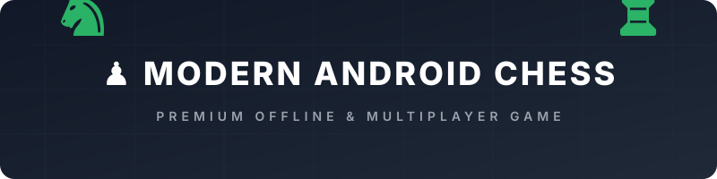

<p align="center">
  
</p>

<div align="center">

### 🛠️ Development & Environment
[](https://kotlinlang.org)
[](https://developer.android.com)
[](LICENSE)

### 📈 GitHub Statistics
[](https://github.com/Yeamin-Talukder/Chess-app/stargazers)
[](https://github.com/Yeamin-Talukder/Chess-app/network/members)
[](https://github.com/Yeamin-Talukder/Chess-app/issues)

### 🚀 Deployments & Downloads
[](https://github.com/Yeamin-Talukder/Chess-app/releases)
[](https://github.com/Yeamin-Talukder/Chess-app/releases)

</div>

---

## 📖 Introduction

Inspired by the polished UX of Chess.com, this application features a sleek glassmorphic UI, responsive 60fps animations, haptic feedback, local statistics tracking, an offline Lichess puzzle engine, custom AI bot opponent, and zero-internet local multiplayer (Wi-Fi Local Network / Direct / Bluetooth).

---

## ✨ Features

### 🎮 Game Modes

- **Pass & Play (Local Offline)**
  - Dual player support on a single device with smart board rotation.
  - Interactive move history timeline, move undo, and draw/resign actions.
- **Offline Puzzles**
  - Access to 1,000+ pre-extracted offline Lichess puzzles.
  - Interactive theme filtering, rating progress tracking, and smart hint assistance.
- **Play vs AI Bot**
  - Integrated offline chess engine with adjustable difficulty levels.
- **Local Wi-Fi / Hotspot Multiplayer**
  - Peer-to-peer connection for playing over local networks with zero latency. No internet connection or external servers required.
- **Bluetooth Multiplayer**
  - Play directly with nearby Android devices over Bluetooth.

### 🏆 Full Official Chess Rules Engine

- Standard movement & capture mechanics.
- Real-time Check, Checkmate & Stalemate detection.
- Castling (Kingside & Queenside) support.
- Pawn Promotion with interactive UI dialog selection.
- *En Passant* captures.
- Complete draw condition tracking: Threefold repetition, 50-move rule, and Insufficient material.

### 🎨 UI & UX Design

- **Interactive Animated Hero Header**: Continuous 3D canvas animation featuring an infinite scrolling chessboard and floating ambient unicode pieces.
- **Glassmorphism Design System**: Dark green gradient themes, subtle drop shadows, and modern Material 3 typography.
- **Customizable Themes**: Multiple board styles, custom piece sets, sound toggles, and adjustable haptic feedback levels.
- **Interactive Game Replay**: Full PGN timeline with playback controls (Play, Pause, Jump to specific moves).
- **User Profile & Stats**: Track wins, losses, win rates, game history, and play time locally.

---

## 🛠️ Architecture & Tech Stack

This project is built following **Clean Architecture**, **MVVM**, and modern Android engineering best practices:

* **Language**: Kotlin 1.9+
* **UI Framework**: Jetpack Compose + Material 3
* **Dependency Injection**: Hilt
* **State Management**: StateFlow, SharedFlow & ViewModel
* **Database**: Room Database (Game History & PGN storage)
* **Preferences**: DataStore Preferences
* **Async & Reactive**: Kotlin Coroutines & Flow
* **Network Protocol**: Custom Socket & JSON Event Stream (TCP/UDP socket P2P)
* **Serialization**: Kotlinx Serialization
* **Graphics & Animation**: Compose Canvas & Infinite Transition Engine

---

## 📁 Package Structure

```
com.example.chess
├── animations/       # Custom canvas animations & infinite hero effects
├── core/             # Core application constants & dispatchers
├── database/         # Room Database entities, DAOs, & migrations
├── di/               # Hilt Dependency Injection modules
├── game/             # Pure Kotlin Chess Engine (Board, Rules, Move Generation)
├── history/          # Game history repository & timeline tracking
├── navigation/       # Navigation Compose graph & screen destinations
├── network/          # Socket-based P2P multiplayer protocol & serializers
├── profile/          # User profile state & data store
├── repository/       # Data repositories (Puzzles, Stats, Settings)
├── settings/         # App preferences & theme configuration
├── theme/            # Material 3 color schemes, shapes & typography
└── ui/               # Jetpack Compose UI Screens & Components
    ├── components/   # Reusable UI cards, dialogs & hero animation canvas
    └── screens/      # Home, Board, Bot, Puzzles, History, Profile, About screens
```

---

## ⚙️ Getting Started & Installation

### Prerequisites

* **Android Studio**: Jellyfish | 2023.3.1 or newer
* **JDK**: Java 17
* **Minimum SDK**: Android 8.0 (API Level 26)
* **Target SDK**: Android 14 (API Level 34)

### Building the Project

1. **Clone the repository**:
   ```bash
   git clone https://github.com/Yeamin-Talukder/Chess-app.git
   cd Chess-app
   ```

2. **Open in Android Studio**:
   Open Android Studio, select `Open an existing project`, and choose the root directory of the repository.

3. **Build Debug APK**:
   ```bash
   ./gradlew assembleDebug
   ```

4. **Run Unit Tests**:
   ```bash
   ./gradlew test
   ```

---

## 👤 Developer

Developed with ❤️ by **MD YEAMIN TALUKDER**

* GitHub: [@Yeamin-Talukder](https://github.com/Yeamin-Talukder)

---

## 📄 License

This project is licensed under the MIT License - see the [LICENSE](LICENSE) file for details.

